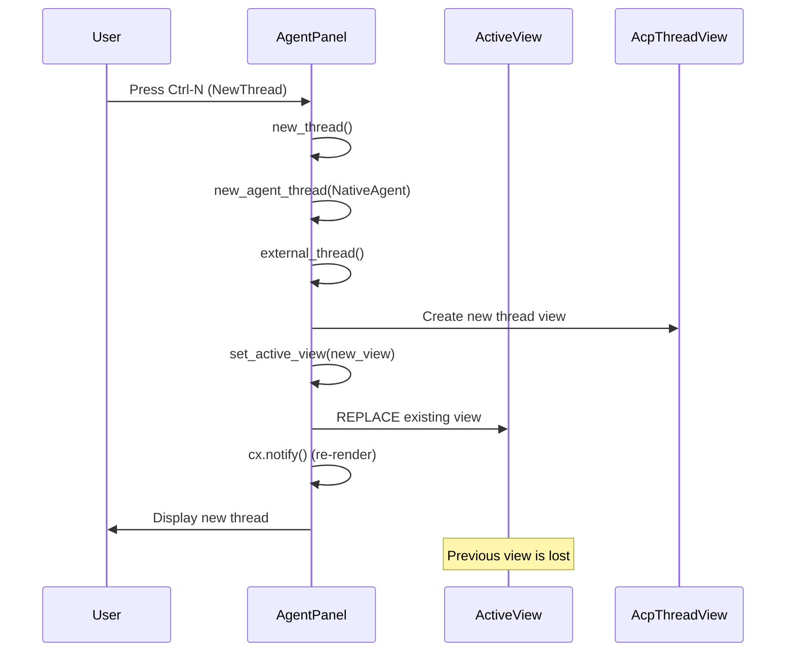

# Zed-Agent Tabs Feature Analysis

## Executive Summary

This document provides a comprehensive analysis of the feasibility and implementation approach for adding tab support to Zed-Agent, allowing multiple concurrent conversations to work simultaneously.

Currently, when opening a new conversation in Zed-Agent, the previous conversation is closed and terminated. This analysis explores how to modify the architecture to support multiple concurrent conversations using a tab-based interface.

## Table of Contents

1. [Current Architecture](#current-architecture)
2. [Problem Statement](#problem-statement)
3. [Comparative Analysis](#comparative-analysis)
4. [Proposed Solutions](#proposed-solutions)
5. [Detailed Implementation Plan](#detailed-implementation-plan)
6. [Code Examples](#code-examples)
7. [Considerations and Trade-offs](#considerations-and-trade-offs)
8. [Testing Strategy](#testing-strategy)
9. [Migration Path](#migration-path)
10. [Timeline Estimate](#timeline-estimate)

---

## Current Architecture

### AgentPanel Structure

The `AgentPanel` is the main component that manages agent conversations in Zed. It's located at:

```rust
zed/crates/agent_ui/src/agent_panel.rs
```

Key components:

```rust
pub struct AgentPanel {
    workspace: WeakEntity<Workspace>,
    project: Entity<Project>,
    acp_history: Entity<AcpThreadHistory>,
    thread_store: Entity<ThreadStore>,
    active_view: ActiveView,  // ← Currently only ONE view
    previous_view: Option<ActiveView>,
    // ... other fields ...
}
```

### ActiveView Enum

The `ActiveView` enum determines what's currently displayed:

```rust
enum ActiveView {
    ExternalAgentThread {
        thread_view: Entity<AcpThreadView>,
    },
    TextThread {
        text_thread_editor: Entity<TextThreadEditor>,
        title_editor: Entity<Editor>,
        buffer_search_bar: Entity<BufferSearchBar>,
        _subscriptions: Vec<gpui::Subscription>,
    },
    History {
        kind: HistoryKind,
    },
    Configuration,
}
```

**Problem:** Only one `active_view` can exist at a time.

### Thread Creation Flow

When a new thread is created:



The `set_active_view` method is the culprit:

```rust
fn set_active_view(
    &mut self,
    new_view: ActiveView,
    focus: bool,
    window: &mut Window,
    cx: &mut Context<Self>,
) {
    // ... logic ...
    self.active_view = new_view;  // ← REPLACES the old view
    // ... logic ...
}
```

### Panel Implementation

`AgentPanel` implements the `Panel` trait:

```rust
impl Panel for AgentPanel {
    fn persistent_name() -> &'static str {
        "AgentPanel"
    }

    fn panel_key() -> &'static str {
        "agent"
    }

    // ... other methods ...
}
```

Panels are managed by the `Dock` system in `zed/crates/workspace/src/dock.rs`.

---

## Problem Statement

### Current Behavior

1. **Single Conversation Limitation**: Only one Zed-Agent conversation can be active at a time
2. **State Loss**: Opening a new conversation terminates and discards the previous one
3. **No Parallel Workflows**: Users cannot work on multiple tasks simultaneously
4. **Context Switching Overhead**: Users must finish one task before starting another

### User Impact

- Developers cannot maintain multiple concurrent coding sessions
- Refactoring work blocks feature development work
- Documentation research blocks implementation work
- Code review blocks issue investigation

### Desired Behavior

1. **Multiple Concurrent Conversations**: Support multiple Zed-Agent conversations simultaneously
2. **Independent State**: Each conversation maintains its own state, history, and context
3. **Easy Navigation**: Tab-based interface for switching between conversations
4. **Persistent State**: Conversations persist when switching between tabs
5. **Familiar UX**: Similar to web browser tabs or editor tabs

---

## Comparative Analysis

### TerminalPanel - Tabs Success Story

The `TerminalPanel` successfully implements tabs through a different architecture:

```rust
pub struct TerminalPanel {
    pub(crate) active_pane: Entity<Pane>,
    pub(crate) center: PaneGroup,  // ← Supports multiple panes
    // ...
}
```

Key differences:

| Aspect | AgentPanel | TerminalPanel |
|--------|-----------|---------------|
| Content Management | Single `active_view` | `PaneGroup` with multiple `Pane` |
| Item Storage | Inline enum | `Vec<Box<dyn ItemHandle>>` |
| Tab Implementation | None | Built into `Pane` |
| Architecture | Direct rendering | Item-based rendering |

### Pane Architecture

`Pane` supports multiple items (terminals, files, etc.):

```rust
pub struct Pane {
    items: Vec<Box<dyn ItemHandle>>,  // ← Multiple items
    active_item_index: usize,
    // ...
}
```

The `Pane` renders a tab bar automatically when multiple items exist.

### ProjectPanel - Single View Alternative

`ProjectPanel` maintains a single view but uses different navigation strategies:

- Tree-based navigation
- Multiple selection support
- Inline filtering

Not suitable for agent conversations which need independent state.

---

## Proposed Solutions

### Solution 1: Use PaneGroup (TerminalPanel Style)

**Approach:** Refactor `AgentPanel` to use `PaneGroup` like `TerminalPanel`.

#### Architecture

```rust
pub struct AgentPanel {
    center: PaneGroup,
    active_pane: Entity<Pane>,
    // ...
}
```

#### Implementation Steps

1. **Create AgentThreadItem trait:**

```rust
pub trait AgentThreadItem: Item {
    fn thread_title(&self, cx: &App) -> SharedString;
    fn thread_id(&self, cx: &App) -> Option<SessionId>;
}
```

2. **Implement Item for AcpThreadView:**

```rust
impl Item for AcpThreadView {
    fn to_item_events(
        &self,
        cx: &mut App,
    ) -> Vec<ItemEvent> {
        // Implement item events
    }
    
    // ... other Item methods ...
}

impl AgentThreadItem for AcpThreadView {
    fn thread_title(&self, cx: &App) -> SharedString {
        self.title()
    }
    
    fn thread_id(&self, cx: &App) -> Option<SessionId> {
        self.session_id()
    }
}
```

3. **Refactor AgentPanel:**

```rust
impl AgentPanel {
    pub fn new(workspace: &Workspace, window: &mut Window, cx: &mut Context<Self>) -> Self {
        let pane = Pane::new(/* ... */);
        let center = PaneGroup::new(pane.clone());
        
        Self {
            center,
            active_pane: pane,
            // ...
        }
    }
    
    fn add_thread(&mut self, thread: Entity<AcpThreadView>, window: &mut Window, cx: &mut Context<Self>) {
        self.active_pane.update(cx, |pane, cx| {
            pane.add_item(thread.clone(), cx);
        });
    }
}
```

#### Pros

- ✅ Uses proven `Pane` infrastructure
- ✅ Consistent with other panels (Terminal, Project)
- ✅ Built-in tab rendering
- ✅ Automatic focus management
- ✅ Drag-and-drop support (via Pane)

#### Cons

- ❌ Significant refactoring required
- ❌ `AcpThreadView` must implement `Item` trait
- ❌ May break existing AcpThreadView functionality
- ❌ Complex lifecycle management
- ❌ Potential performance overhead

#### Complexity: HIGH
#### Effort: 3-4 weeks

---

### Solution 2: Custom Tabs System (Recommended)

**Approach:** Add custom tabs management to `AgentPanel` while preserving current architecture.

#### Architecture

```rust
pub struct AgentPanel {
    tabs: Vec<AgentTab>,
    active_tab_index: usize,
    // ... existing fields ...
}

pub struct AgentTab {
    id: Uuid,
    title: SharedString,
    active_view: ActiveView,
    created_at: Instant,
    is_active: bool,
}
```

#### Implementation Steps

1. **Add tabs fields to AgentPanel:**

```rust
pub struct AgentPanel {
    // ... existing fields ...
    tabs: Vec<AgentTab>,
    active_tab_index: usize,
    // ...
}
```

2. **Create tab management methods:**

```rust
impl AgentPanel {
    pub fn add_new_tab(
        &mut self,
        title: impl Into<SharedString>,
        active_view: ActiveView,
        focus: bool,
        window: &mut Window,
        cx: &mut Context<Self>,
    ) {
        let tab = AgentTab::new(title, active_view);
        
        for tab in &mut self.tabs {
            tab.is_active = false;
        }
        
        self.tabs.push(tab);
        self.active_tab_index = self.tabs.len() - 1;
        self.tabs[self.active_tab_index].is_active = true;
        
        if focus {
            self.focus_handle(cx).focus(window, cx);
        }
        
        cx.notify();
        self.serialize(cx);
    }
    
    pub fn select_tab(
        &mut self,
        index: usize,
        window: &mut Window,
        cx: &mut Context<Self>,
    ) {
        if index >= self.tabs.len() {
            return;
        }
        
        if let Some(current) = self.tabs.get_mut(self.active_tab_index) {
            current.is_active = false;
        }
        
        self.active_tab_index = index;
        self.tabs[index].is_active = true;
        
        cx.notify();
    }
    
    pub fn close_tab(
        &mut self,
        index: usize,
        window: &mut Window,
        cx: &mut Context<Self>,
    ) {
        if self.tabs.len() == 1 {
            // Don't close last tab, replace with new thread
            self.new_thread(&NewThread, window, cx);
            return;
        }
        
        self.tabs.remove(index);
        
        if index <= self.active_tab_index {
            self.active_tab_index = self.active_tab_index.saturating_sub(1);
        }
        
        if self.active_tab_index >= self.tabs.len() {
            self.active_tab_index = self.tabs.len() - 1;
        }
        
        self.tabs[self.active_tab_index].is_active = true;
        
        cx.notify();
        self.serialize(cx);
    }
}
```

3. **Modify thread creation:**

```rust
fn new_thread(&mut self, _action: &NewThread, window: &mut Window, cx: &mut Context<Self>) {
    let title = "New Thread";
    let thread_view = self.create_native_agent_thread(window, cx);
    
    self.add_new_tab(
        title,
        ActiveView::ExternalAgentThread { thread_view },
        true,
        window,
        cx,
    );
}
```

4. **Add tab bar rendering:**

```rust
impl Render for AgentPanel {
    fn render(&mut self, window: &mut Window, cx: &mut Context<Self>) -> impl IntoElement {
        v_flex()
            .size_full()
            .when(!self.tabs.is_empty(), |this| {
                this.child(self.render_tab_bar(window, cx))
            })
            .when_some(self.active_tab(), |this, tab| {
                this.child(self.render_active_view(&tab.active_view, window, cx))
            })
    }
}
```

#### Pros

- ✅ Minimal changes to existing architecture
- ✅ Preserves AcpThreadView functionality
- ✅ Full control over tab behavior
- ✅ Faster to implement
- ✅ Easier to debug and maintain
- ✅ Can evolve independently

#### Cons

- ❌ Separate tab system (not shared with other panels)
- ❌ Must implement custom tab UI
- ❌ Manual focus management

#### Complexity: MEDIUM
#### Effort: 1-2 weeks

---

### Solution 3: Hybrid Approach

**Approach:** Use internal tabs for agent threads, but delegate to `Pane` for other views (history, configuration).

#### Architecture

```rust
pub struct AgentPanel {
    tabs: Vec<AgentTab>,  // Only for thread views
    active_tab_index: usize,
    // For non-thread views
    current_view: Option<ActiveView>,
    // ...
}
```

#### Implementation

```rust
enum ActiveView {
    TabsView,  // When multiple threads are active
    History { kind: HistoryKind },
    Configuration,
}

impl AgentPanel {
    fn render(&mut self, window: &mut Window, cx: &mut Context<Self>) -> impl IntoElement {
        match &self.current_view {
            Some(ActiveView::TabsView) => self.render_tabs_view(window, cx),
            Some(ActiveView::History { .. }) => self.render_history_view(window, cx),
            Some(ActiveView::Configuration) => self.render_configuration_view(window, cx),
            None => self.render_empty_state(window, cx),
        }
    }
}
```

#### Pros

- ✅ Best of both worlds
- ✅ Tabs for threads, specialized views for other features
- ✅ Flexible architecture

#### Cons

- ❌ More complex state management
- ❌ Potential confusion in navigation

#### Complexity: MEDIUM-HIGH
#### Effort: 2-3 weeks

---

## Detailed Implementation Plan

### Phase 1: Foundation (3-5 days)

#### 1.1 Create Tabs Module

Create `zed/crates/agent_ui/src/tabs/mod.rs`:

```rust
pub mod tabs;
pub use tabs::{AgentTab, AgentTabs};
```

#### 1.2 Define Tab Structure

```rust
/// Represents a single tab in the agent panel
#[derive(Clone, Debug)]
pub struct AgentTab {
    pub id: Uuid,
    pub title: SharedString,
    pub active_view: ActiveView,
    pub created_at: Instant,
    pub is_active: bool,
    pub session_id: Option<acp_thread::SessionId>,
    pub is_modified: bool,
}
```

#### 1.3 Implement Tabs Manager

```rust
pub struct AgentTabs {
    tabs: Vec<AgentTab>,
    active_tab_index: usize,
    max_tabs: usize,
}

impl AgentTabs {
    pub fn new() -> Self { /* ... */ }
    pub fn add_tab(&mut self, tab: AgentTab) -> &mut AgentTab { /* ... */ }
    pub fn select_tab(&mut self, index: usize) -> Option<&AgentTab> { /* ... */ }
    pub fn close_tab(&mut self, index: usize) -> Option<AgentTab> { /* ... */ }
    pub fn active_tab(&self) -> Option<&AgentTab> { /* ... */ }
    pub fn find_tab_by_session(&self, id: &acp_thread::SessionId) -> Option<&AgentTab> { /* ... */ }
}
```

#### 1.4 Add Tabs to AgentPanel

```rust
pub struct AgentPanel {
    // ... existing fields ...
    tabs: Vec<AgentTab>,
    active_tab_index: usize,
    // ...
}

impl AgentPanel {
    pub fn new(/* ... */) -> Self {
        Self {
            // ... existing initialization ...
            tabs: Vec::new(),
            active_tab_index: 0,
            // ...
        }
    }
}
```

### Phase 2: Thread Creation Integration (3-5 days)

#### 2.1 Modify new_thread Method

**Before:**

```rust
fn new_thread(&mut self, _action: &NewThread, window: &mut Window, cx: &mut Context<Self>) {
    self.new_agent_thread(AgentType::NativeAgent, window, cx);
}
```

**After:**

```rust
fn new_thread(&mut self, _action: &NewThread, window: &mut Window, cx: &mut Context<Self>) {
    let title = "New Thread";
    let thread_view = self.create_native_agent_thread(window, cx);
    
    self.add_new_tab(
        title,
        ActiveView::ExternalAgentThread { thread_view },
        true,
        window,
        cx,
    );
}
```

#### 2.2 Modify load_agent_thread Method

```rust
pub fn load_agent_thread(
    &mut self,
    thread_info: AgentSessionInfo,
    window: &mut Window,
    cx: &mut Context<Self>,
) {
    let title = thread_info.title.clone().unwrap_or_else(|| "Thread".into());
    let thread_view = self.load_thread_from_session(thread_info, window, cx);
    
    self.add_new_tab(
        title,
        ActiveView::ExternalAgentThread { thread_view },
        true,
        window,
        cx,
    );
}
```

#### 2.3 Implement Thread Title Updates

Listen to title changes in AcpThreadView and update tab titles:

```rust
fn _external_thread(
    &mut self,
    // ... existing parameters ...
    cx: &mut Context<Self>,
) {
    let thread_view = cx.new(|cx| {
        // ... existing code ...
    });
    
    // NEW: Subscribe to title changes
    let thread_id = thread_view.read(cx).session_id();
    cx.subscribe(&thread_view, move |this, thread_view, event, cx| {
        if let Some(session_id) = thread_id {
            if let Some(tab) = this.tabs.iter_mut().find(|t| t.session_id.as_ref() == Some(&session_id)) {
                if let AcpThreadEvent::TitleChanged(title) = event {
                    tab.title = title.clone();
                    cx.notify();
                }
            }
        }
    }).detach();
    
    // ... rest of existing code ...
}
```

### Phase 3: UI Implementation (5-7 days)

#### 3.1 Render Tab Bar

```rust
impl AgentPanel {
    fn render_tab_bar(
        &self,
        window: &mut Window,
        cx: &mut Context<Self>,
    ) -> impl IntoElement {
        let theme = cx.theme();
        
        h_flex()
            .w_full()
            .h(px(32.))
            .border_b_1()
            .border_color(theme.colors().border)
            .gap(px(2.))
            .px_2()
            .items_center()
            .children(self.tabs.iter().enumerate().map(|(index, tab)| {
                let is_active = index == self.active_tab_index;
                
                self.render_tab_item(index, tab, is_active, window, cx)
            }))
    }
    
    fn render_tab_item(
        &self,
        index: usize,
        tab: &AgentTab,
        is_active: bool,
        window: &mut Window,
        cx: &mut Context<Self>,
    ) -> impl IntoElement {
        let theme = cx.theme();
        
        div()
            .id(ElementId::Named(format!("agent-tab-{}", tab.id).into()))
            .flex()
            .items_center()
            .justify_between()
            .h_full()
            .min_w(px(100.))
            .max_w(px(200.))
            .px_2()
            .gap_2()
            .rounded_t_md()
            .cursor_pointer()
            .when(is_active, |this| {
                this.bg(theme.colors().surface_background)
                    .border_b_2()
                    .border_color(theme.colors().border_selected)
            })
            .when(!is_active, |this| {
                this.hover(|style| style.bg(theme.colors().surface_hover))
            })
            .child(self.render_tab_title(tab))
            .when(self.tabs.len() > 1, |this| {
                this.child(self.render_close_button(index, window, cx))
            })
            .on_click(cx.listener(move |this, event, window, cx| {
                event.stop_propagation();
                this.select_tab(index, window, cx);
            }))
    }
    
    fn render_tab_title(&self, tab: &AgentTab) -> impl IntoElement {
        div()
            .overflow_hidden()
            .text_ellipsis()
            .whitespace_nowrap()
            .text_sm()
            .when(tab.is_modified, |this| this.italic())
            .text_color(self.cx.theme().colors().text)
            .child(tab.title.clone())
    }
    
    fn render_close_button(
        &self,
        index: usize,
        window: &mut Window,
        cx: &mut Context<Self>,
    ) -> impl IntoElement {
        IconButton::new(
            format!("close-tab-{}", self.tabs[index].id),
            IconName::Close,
        )
        .icon_size(IconSize::XSmall)
        .xsmall()
        .rounded()
        .on_click(cx.listener(move |this, event, window, cx| {
            event.stop_propagation();
            this.close_tab(index, window, cx);
        }))
    }
}
```

#### 3.2 Modify Main Render

```rust
impl Render for AgentPanel {
    fn render(&mut self, window: &mut Window, cx: &mut Context<Self>) -> impl IntoElement {
        let theme = cx.theme();
        
        v_flex()
            .size_full()
            .bg(theme.colors().panel_background)
            // Render tab bar if we have tabs
            .when(!self.tabs.is_empty(), |this| {
                this.child(self.render_tab_bar(window, cx))
            })
            // Render active view
            .when_some(self.active_tab(), |this, tab| {
                this.child(self.render_active_view(&tab.active_view, window, cx))
            })
            // Render empty state
            .when(self.tabs.is_empty(), |this| {
                this.child(self.render_empty_state(window, cx))
            })
    }
}
```

#### 3.3 Render Active View

```rust
fn render_active_view(
    &self,
    active_view: &ActiveView,
    window: &mut Window,
    cx: &mut Context<Self>,
) -> impl IntoElement {
    match active_view {
        ActiveView::ExternalAgentThread { thread_view } => {
            thread_view.read(cx).clone().into_any()
        }
        ActiveView::TextThread { 
            text_thread_editor, 
            title_editor, 
            buffer_search_bar, 
            .. 
        } => {
            v_flex()
                .size_full()
                .child(
                    div()
                        .h(px(32.))
                        .child(title_editor.read(cx).clone())
                )
                .child(
                    div()
                        .flex_1()
                        .child(text_thread_editor.read(cx).clone())
                )
                .into_any()
        }
        ActiveView::History { kind } => {
            self.render_history_view(kind, window, cx).into_any()
        }
        ActiveView::Configuration => {
            self.render_configuration_view(window, cx).into_any()
        }
    }
}
```

### Phase 4: Actions and Keybindings (2-3 days)

#### 4.1 Define Actions

In `zed/crates/agent_ui/src/agent_ui.rs`:

```rust
actions!(
    agent,
    [
        // ... existing actions ...
        
        /// Navigate to the next agent tab
        NextAgentTab,
        /// Navigate to the previous agent tab
        PreviousAgentTab,
        /// Create a new agent tab
        NewAgentTab,
        /// Close the current agent tab
        CloseAgentTab,
    ]
);
```

#### 4.2 Register Action Handlers

In `zed/crates/agent_ui/src/agent_panel.rs` `init()` function:

```rust
pub fn init(cx: &mut App) {
    // ... existing registrations ...
    
    cx.observe_new(
        |workspace: &mut Workspace, _window, _: &mut Context<Workspace>| {
            // ... existing handlers ...
            
            workspace.register_action(|workspace, _: &NextAgentTab, window, cx| {
                if let Some(panel) = workspace.panel::<AgentPanel>(cx) {
                    panel.update(cx, |panel, cx| panel.next_tab(window, cx));
                }
            });
            
            workspace.register_action(|workspace, _: &PreviousAgentTab, window, cx| {
                if let Some(panel) = workspace.panel::<AgentPanel>(cx) {
                    panel.update(cx, |panel, cx| panel.previous_tab(window, cx));
                }
            });
            
            workspace.register_action(|workspace, _: &NewAgentTab, window, cx| {
                if let Some(panel) = workspace.panel::<AgentPanel>(cx) {
                    panel.update(cx, |panel, cx| panel.new_thread(&NewThread, window, cx));
                }
            });
            
            workspace.register_action(|workspace, _: &CloseAgentTab, window, cx| {
                if let Some(panel) = workspace.panel::<AgentPanel>(cx) {
                    panel.update(cx, |panel, cx| {
                        if panel.tabs().len() > 1 {
                            panel.close_tab(panel.active_index(), window, cx);
                        }
                    });
                }
            });
        },
    ).detach();
}
```

#### 4.3 Add Keybindings

In `zed/assets/keymaps/default-linux.json`:

```json
{
  "context": "AgentPanel || AcpThreadView",
  "bindings": {
    "ctrl-tab": "agent::NextAgentTab",
    "ctrl-shift-tab": "agent::PreviousAgentTab",
    "ctrl-t": "agent::NewAgentTab",
    "ctrl-w": "agent::CloseAgentTab"
  }
}
```

Similar changes for macOS (Cmd instead of Ctrl) and Windows.

### Phase 5: Persistence (2-3 days)

#### 5.1 Extend Serialization Structure

```rust
#[derive(Serialize, Deserialize, Clone, Debug)]
pub struct SerializedAgentPanel {
    // ... existing fields ...
    tabs: Vec<SerializedTab>,
    active_tab_index: usize,
}

#[derive(Serialize, Deserialize, Clone, Debug)]
struct SerializedTab {
    id: Uuid,
    title: SharedString,
    session_id: Option<acp_thread::SessionId>,
    created_at: u64,  // Unix timestamp
    tab_type: TabType,
}

#[derive(Serialize, Deserialize, Clone, Debug)]
enum TabType {
    NativeAgent,
    TextThread,
    History,
    Configuration,
}
```

#### 5.2 Implement Save

```rust
fn serialize(&mut self, cx: &mut Context<Self>) {
    let tabs = self.tabs.iter().map(|tab| SerializedTab {
        id: tab.id,
        title: tab.title.clone(),
        session_id: tab.session_id.clone(),
        created_at: tab.created_at.duration_since(UNIX_EPOCH).unwrap().as_secs(),
        tab_type: match &tab.active_view {
            ActiveView::ExternalAgentThread { .. } => TabType::NativeAgent,
            ActiveView::TextThread { .. } => TabType::TextThread,
            ActiveView::History { .. } => TabType::History,
            ActiveView::Configuration => TabType::Configuration,
        },
    }).collect();
    
    let serialized = SerializedAgentPanel {
        width: self.width,
        selected_agent: self.selected_agent,
        tabs,
        active_tab_index: self.active_tab_index,
        // ... other fields ...
    };
    
    if let Ok(data) = serde_json::to_string(&serialized) {
        cx.background_spawn({
            async move {
                db::kvp::KEY_VALUE_STORE
                    .write_kvp("agent_panel_tabs".to_string(), data)
                    .await
                    .log_err();
            }
        }).detach();
    }
}
```

#### 5.3 Implement Load

```rust
pub fn load(
    workspace: &mut Workspace,
    window: &mut Window,
    cx: &mut Context<Workspace>,
) -> Task<Entity<AgentPanel>> {
    let workspace = workspace.weak_handle();
    
    cx.spawn(|mut cx| async move {
        let serialized = cx.background_spawn(|| async {
            db::kvp::KEY_VALUE_STORE
                .read_kvp("agent_panel_tabs")
                .await
        }).await;
        
        let panel = workspace.update_in(&mut cx, |workspace, window, cx| {
            let mut panel = AgentPanel::new(workspace, window, cx);
            
            if let Some(Ok(data)) = serialized {
                if let Ok(serialized) = serde_json::from_str::<SerializedAgentPanel>(&data) {
                    panel.load_tabs(serialized, window, cx);
                }
            }
            
            panel
        }).ok()?;
        
        Ok(panel)
    })
}

fn load_tabs(
    &mut self,
    serialized: SerializedAgentPanel,
    window: &mut Window,
    cx: &mut Context<Self>,
) {
    self.tabs.clear();
    self.active_tab_index = serialized.active_tab_index;
    
    for tab in serialized.tabs {
        let active_view = match tab.tab_type {
            TabType::NativeAgent => {
                if let Some(session_id) = &tab.session_id {
                    self.load_thread_from_session_id(session_id, window, cx)
                } else {
                    continue;
                }
            }
            TabType::TextThread => {
                // Load text thread
                todo!("Implement text thread loading")
            }
            TabType::History => ActiveView::History {
                kind: HistoryKind::AgentThreads,
            },
            TabType::Configuration => ActiveView::Configuration,
        };
        
        let agent_tab = AgentTab {
            id: tab.id,
            title: tab.title,
            active_view,
            created_at: UNIX_EPOCH + Duration::from_secs(tab.created_at),
            is_active: false,
            session_id: tab.session_id,
            is_modified: false,
        };
        
        self.tabs.push(agent_tab);
    }
    
    // Set active tab
    if let Some(index) = self.tabs.get_mut(self.active_tab_index) {
        index.is_active = true;
    }
}
```

### Phase 6: Testing (3-4 days)

#### 6.1 Unit Tests

```rust
#[cfg(test)]
mod tests {
    use super::*;
    use gpui::TestAppContext;
    
    #[gpui::test]
    async fn test_add_tab(cx: &mut TestAppContext) {
        let mut tabs = AgentTabs::new();
        let tab = AgentTab::new("Test Thread", ActiveView::History {
            kind: HistoryKind::AgentThreads,
        });
        
        tabs.add_tab(tab);
        assert_eq!(tabs.tab_count(), 1);
        assert_eq!(tabs.active_index(), 0);
    }
    
    #[gpui::test]
    async fn test_select_tab(cx: &mut TestAppContext) {
        let mut tabs = AgentTabs::new();
        
        tabs.add_tab(AgentTab::new("Thread 1", /* ... */));
        tabs.add_tab(AgentTab::new("Thread 2", /* ... */));
        tabs.add_tab(AgentTab::new("Thread 3", /* ... */));
        
        tabs.select_tab(1);
        assert_eq!(tabs.active_index(), 1);
        
        tabs.select_tab(0);
        assert_eq!(tabs.active_index(), 0);
    }
    
    #[gpui::test]
    async fn test_close_tab(cx: &mut TestAppContext) {
        let mut tabs = AgentTabs::new();
        
        tabs.add_tab(AgentTab::new("Thread 1", /* ... */));
        tabs.add_tab(AgentTab::new("Thread 2", /* ... */));
        
        let closed = tabs.close_tab(0);
        assert!(closed.is_some());
        assert_eq!(tabs.tab_count(), 1);
    }
    
    #[gpui::test]
    async fn test_cannot_close_last_tab(cx: &mut TestAppContext) {
        let mut tabs = AgentTabs::new();
        
        tabs.add_tab(AgentTab::new("Thread 1", /* ... */));
        
        let closed = tabs.close_tab(0);
        assert!(closed.is_none());
        assert_eq!(tabs.tab_count(), 1);
    }
}
```

#### 6.2 Integration Tests

```rust
#[cfg(test)]
mod integration_tests {
    use super::*;
    
    async fn test_multiple_concurrent_threads(cx: &mut TestAppContext) {
        let workspace = cx.add_window(|cx| Workspace::test(cx));
        let agent_panel = workspace.read(cx).panel::<AgentPanel>(cx).unwrap();
        
        // Create multiple threads
        agent_panel.update(cx, |panel, window, cx| {
            panel.new_thread(&NewThread, window, cx);
        });
        
        agent_panel.update(cx, |panel, window, cx| {
            panel.new_thread(&NewThread, window, cx);
        });
        
        agent_panel.update(cx, |panel, window, cx| {
            panel.new_thread(&NewThread, window, cx);
        });
        
        // Verify all tabs exist
        let panel = agent_panel.read(cx);
        assert_eq!(panel.tabs().len(), 3);
        
        // Verify switching works
        agent_panel.update(cx, |panel, window, cx| {
            panel.select_tab(0, window, cx);
            assert_eq!(panel.active_index(), 0);
            
            panel.select_tab(1, window, cx);
            assert_eq!(panel.active_index(), 1);
            
            panel.next_tab(window, cx);
            assert_eq!(panel.active_index(), 2);
            
            panel.previous_tab(window, cx);
            assert_eq!(panel.active_index(), 1);
        });
    }
    
    async fn test_tab_persistence(cx: &mut TestAppContext) {
        let workspace = cx.add_window(|cx| Workspace::test(cx));
        let agent_panel = workspace.read(cx).panel::<AgentPanel>(cx).unwrap();
        
        // Create tabs
        agent_panel.update(cx, |panel, window, cx| {
            panel.new_thread(&NewThread, window, cx);
            panel.new_thread(&NewThread, window, cx);
        });
        
        // Serialize
        agent_panel.update(cx, |panel, cx| {
            panel.serialize(cx);
        });
        
        // Simulate reload
        let new_panel = AgentPanel::load(&workspace, &mut cx.window(0), &mut cx).await.ok().unwrap();
        
        // Verify tabs restored
        let panel = new_panel.read(cx);
        assert_eq!(panel.tabs().len(), 2);
    }
}
```

#### 6.3 Manual Testing Checklist

- [ ] Create new thread via Ctrl-N
- [ ] Verify new tab appears
- [ ] Create another thread
- [ ] Switch between tabs
- [ ] Close a tab (click X)
- [ ] Close tab via Ctrl-W
- [ ] Navigate tabs via Ctrl-Tab / Ctrl-Shift-Tab
- [ ] Verify thread state preserved when switching
- [ ] Verify thread title updates
- [ ] Reload workspace and verify tabs persist
- [ ] Test with 10+ concurrent tabs
- [ ] Test with text threads
- [ ] Test closing last tab (should create new one)
- [ ] Test with different agents (Native, ClaudeCode, etc.)
- [ ] Test with history view
- [ ] Test with configuration view

### Phase 7: Polish and Documentation (2-3 days)

#### 7.1 User Documentation

Add to `zed/docs/user-guide/agent.md`:

```markdown
## Agent Tabs

Zed-Agent supports multiple concurrent conversations through tabs.

### Creating a New Tab

- Press `Ctrl/Cmd-T` to create a new conversation tab
- Press `Ctrl/Cmd-N` to create a new thread in the active tab

### Navigating Tabs

- `Ctrl/Cmd-Tab` - Switch to the next tab
- `Ctrl/Cmd-Shift-Tab` - Switch to the previous tab
- `Ctrl/Cmd-1` through `Ctrl/Cmd-9` - Switch to a specific tab

### Closing Tabs

- Click the X button on a tab to close it
- Press `Ctrl/Cmd-W` to close the active tab
- The last tab cannot be closed; closing it creates a new empty tab

### Managing Tabs

Each tab maintains its own:
- Conversation history
- Context and mentions
- Active model selection
- Burn mode state
- Follow mode state

Switching between tabs does not terminate the inactive conversations; they remain active in the background.
```

#### 7.2 Code Documentation

Add rustdoc comments:

```rust
/// Adds a new tab to the agent panel with the given title and view.
///
/// This method creates a new tab, deactivates all existing tabs,
/// activates the new tab, and optionally focuses it.
///
/// # Arguments
///
/// * `title` - The display title for the tab
/// * `active_view` - The view content for the tab
/// * `focus` - Whether to focus the new tab
/// * `window` - The window context
/// * `cx` - The component context
///
/// # Examples
///
/// ```ignore
/// panel.add_new_tab(
///     "Refactoring Work",
///     ActiveView::ExternalAgentThread { thread_view },
///     true,
///     window,
///     cx,
/// );
/// ```
pub fn add_new_tab(
    &mut self,
    title: impl Into<SharedString>,
    active_view: ActiveView,
    focus: bool,
    window: &mut Window,
    cx: &mut Context<Self>,
) {
    // ... implementation ...
}
```

#### 7.3 Performance Optimization

Consider adding:

1. **Lazy loading**: Only render visible tab content
2. **Tab limit**: Cap maximum tabs (e.g., 20) with warning
3. **Tab pooling**: Reuse tab structures
4. **Debounced serialization**: Save tabs state less frequently

---

## Code Examples

### Complete AgentTab Implementation

```rust
use std::time::Instant;
use uuid::Uuid;
use gpui::{App, Context, Entity, SharedString, Window};
use ui::prelude::*;

/// Represents a single conversation tab in the agent panel
#[derive(Clone, Debug)]
pub struct AgentTab {
    /// Unique identifier for this tab
    pub id: Uuid,
    
    /// Display title shown in the tab bar
    pub title: SharedString,
    
    /// The active view content for this tab
    pub active_view: ActiveView,
    
    /// When this tab was created
    pub created_at: Instant,
    
    /// Whether this tab is currently active/selected
    pub is_active: bool,
    
    /// The session ID for agent threads (None for non-thread tabs)
    pub session_id: Option<acp_thread::SessionId>,
    
    /// Whether the tab has unsaved changes
    pub is_modified: bool,
}

impl AgentTab {
    /// Creates a new agent tab
    pub fn new(title: impl Into<SharedString>, active_view: ActiveView) -> Self {
        Self {
            id: Uuid::new_v4(),
            title: title.into(),
            active_view,
            created_at: Instant::now(),
            is_active: false,
            session_id: None,
            is_modified: false,
        }
    }
    
    /// Creates a new tab for an agent thread
    pub fn from_thread(
        title: impl Into<SharedString>,
        thread_view: Entity<AcpThreadView>,
        session_id: acp_thread::SessionId,
    ) -> Self {
        let mut tab = Self::new(title, ActiveView::ExternalAgentThread { thread_view });
        tab.session_id = Some(session_id);
        tab
    }
    
    /// Updates the tab title
    pub fn with_title(mut self, title: impl Into<SharedString>) -> Self {
        self.title = title.into();
        self
    }
    
    /// Marks the tab as modified or unmodified
    pub fn with_modified(mut self, modified: bool) -> Self {
        self.is_modified = modified;
        self
    }
}

impl Default for AgentTab {
    fn default() -> Self {
        Self::new("Untitled", ActiveView::History {
            kind: HistoryKind::AgentThreads,
        })
    }
}
```

### Complete Tab Management Methods

```rust
impl AgentPanel {
    /// Adds a new tab to the agent panel
    ///
    /// This is the primary method for creating new conversation tabs.
    /// It deactivates all existing tabs, creates and activates the new tab,
    /// and optionally focuses the agent panel.
    pub fn add_new_tab(
        &mut self,
        title: impl Into<SharedString>,
        active_view: ActiveView,
        focus: bool,
        window: &mut Window,
        cx: &mut Context<Self>,
    ) {
        let tab = AgentTab::new(title, active_view);
        
        // Deactivate all existing tabs
        for tab in &mut self.tabs {
            tab.is_active = false;
        }
        
        // Add the new tab
        self.tabs.push(tab);
        let index = self.tabs.len() - 1;
        
        // Set as active
        self.tabs[index].is_active = true;
        self.active_tab_index = index;
        
        // Handle focus if requested
        if focus {
            self.focus_handle(cx).focus(window, cx);
        }
        
        // Notify to trigger re-render
        cx.notify();
        
        // Save state
        self.serialize(cx);
    }
    
    /// Selects a tab by index
    ///
    /// Returns `Some(&AgentTab)` if the index is valid, `None` otherwise.
    pub fn select_tab(
        &mut self,
        index: usize,
        window: &mut Window,
        cx: &mut Context<Self>,
    ) -> Option<&AgentTab> {
        if index >= self.tabs.len() {
            return None;
        }
        
        // Deactivate current tab
        if let Some(current) = self.tabs.get_mut(self.active_tab_index) {
            current.is_active = false;
        }
        
        // Activate new tab
        self.active_tab_index = index;
        self.tabs[index].is_active = true;
        
        cx.notify();
        Some(&self.tabs[index])
    }
    
    /// Selects a tab by its unique ID
    ///
    /// Returns `Some(&AgentTab)` if found, `None` otherwise.
    pub fn select_tab_by_id(
        &mut self,
        id: Uuid,
        window: &mut Window,
        cx: &mut Context<Self>,
    ) -> Option<&AgentTab> {
        let index = self.tabs.iter().position(|tab| tab.id == id)?;
        self.select_tab(index, window, cx)
    }
    
    /// Closes a tab by index
    ///
    /// The last tab cannot be closed; instead, it is replaced with a new empty thread.
    /// Returns the closed tab if successful, `None` otherwise.
    pub fn close_tab(
        &mut self,
        index: usize,
        window: &mut Window,
        cx: &mut Context<Self>,
    ) -> Option<AgentTab> {
        if index >= self.tabs.len() {
            return None;
        }
        
        // Don't allow closing the last tab - replace with new thread instead
        if self.tabs.len() == 1 {
            self.new_thread(&NewThread, window, cx);
            return None;
        }
        
        // Remove the tab
        let removed = self.tabs.remove(index);
        
        // Adjust active index if needed
        if index <= self.active_tab_index {
            self.active_tab_index = self.active_tab_index.saturating_sub(1);
        }
        
        // Ensure we have an active tab
        if !self.tabs.is_empty() {
            if self.active_tab_index >= self.tabs.len() {
                self.active_tab_index = self.tabs.len() - 1;
            }
            self.tabs[self.active_tab_index].is_active = true;
        }
        
        cx.notify();
        self.serialize(cx);
        Some(removed)
    }
    
    /// Closes a tab by its unique ID
    ///
    /// Returns the closed tab if found, `None` otherwise.
    pub fn close_tab_by_id(
        &mut self,
        id: Uuid,
        window: &mut Window,
        cx: &mut Context<Self>,
    ) -> Option<AgentTab> {
        let index = self.tabs.iter().position(|tab| tab.id == id)?;
        self.close_tab(index, window, cx)
    }
    
    /// Navigates to the next tab (wraps around)
    pub fn next_tab(&mut self, window: &mut Window, cx: &mut Context<Self>) {
        if self.tabs.is_empty() {
            return;
        }
        
        let new_index = (self.active_tab_index + 1) % self.tabs.len();
        self.select_tab(new_index, window, cx);
    }
    
    /// Navigates to the previous tab (wraps around)
    pub fn previous_tab(&mut self, window: &mut Window, cx: &mut Context<Self>) {
        if self.tabs.is_empty() {
            return;
        }
        
        let new_index = if self.active_tab_index == 0 {
            self.tabs.len() - 1
        } else {
            self.active_tab_index - 1
        };
        
        self.select_tab(new_index, window, cx);
    }
    
    /// Returns a reference to the currently active tab
    pub fn active_tab(&self) -> Option<&AgentTab> {
        self.tabs.get(self.active_tab_index)
    }
    
    /// Returns a mutable reference to the currently active tab
    pub fn active_tab_mut(&mut self) -> Option<&mut AgentTab> {
        self.tabs.get_mut(self.active_tab_index)
    }
    
    /// Returns all tabs
    pub fn tabs(&self) -> &[AgentTab] {
        &self.tabs
    }
    
    /// Returns the number of tabs
    pub fn tab_count(&self) -> usize {
        self.tabs.len()
    }
    
    /// Returns the index of the active tab
    pub fn active_index(&self) -> usize {
        self.active_tab_index
    }
    
    /// Finds a tab by its session ID
    ///
    /// Useful for locating a tab when a thread event occurs.
    pub fn find_tab_by_session(&self, session_id: &acp_thread::SessionId) -> Option<&AgentTab> {
        self.tabs.iter().find(|tab| tab.session_id.as_ref() == Some(session_id))
    }
    
    /// Finds a tab by its active view entity
    pub fn find_tab_by_view(&self, view: &ActiveView) -> Option<&AgentTab> {
        self.tabs.iter().find(|tab| {
            match (&tab.active_view, view) {
                (
                    ActiveView::ExternalAgentThread { thread_view: t1 },
                    ActiveView::ExternalAgentThread { thread_view: t2 },
                ) => Entity::entity_id(t1) == Entity::entity_id(t2),
                (
                    ActiveView::TextThread {
                        text_thread_editor: e1,
                        ..
                    },
                    ActiveView::TextThread {
                        text_thread_editor: e2,
                        ..
                    },
                ) => Entity::entity_id(e1) == Entity::entity_id(e2),
                _ => false,
            }
        })
    }
}
```

---

## Considerations and Trade-offs

### Memory Management

**Concern:** Multiple active threads consume memory and resources.

**Mitigation:**
1. Limit concurrent threads (e.g., max 10 active, rest "dormant")
2. Implement tab "freezing" for inactive tabs (pause background generation)
3. Memory monitoring and warnings
4. Automatic cleanup of very old tabs

### Performance Impact

**Concern:** Rendering multiple tabs may impact performance.

**Mitigation:**
1. Only render visible tab content
2. Lazy load tab content on switch
3. Debounce tab switches
4. Virtual scroll for tab bar (many tabs)

### UX Considerations

**Tab Ordering:**
- **MRU (Most Recently Used):** Tabs reorder based on usage
- **Fixed Order:** Tabs stay in creation order
- **Custom Drag:** User can reorder tabs

**Recommendation:** Start with fixed order, add drag-to-reorder later.

**Tab Persistence:**
- What to save? Session IDs, titles, active index
- What NOT to save? Active model selection, burn mode state
- **Recommendation:** Save minimal state, restore on load

**Tab Limits:**
- Hard limit? 20 tabs with warning
- Soft limit? Performance degrades after 10
- **Recommendation:** Soft limit with UI warning

### Backward Compatibility

**Concern:** Existing users expect single-thread behavior.

**Solution:**
1. Default to single-tab mode (like current behavior)
2. Add setting: `agent.enable_tabs = true`
3. Gradual rollout with feature flag

### State Synchronization

**Challenge:** Multiple tabs may access the same agent server.

**Considerations:**
- Agent server already handles concurrent sessions
- Each thread has unique session ID
- No additional synchronization needed

### Testing Coverage

**Must Test:**
- Tab creation, selection, closing
- Multiple concurrent threads
- Thread state preservation
- Tab persistence across reloads
- Edge cases: closing last tab, maximum tabs, rapid switching

---

## Testing Strategy

### Unit Tests

Focus on `AgentTabs` and tab management logic:

```rust
#[cfg(test)]
mod tests {
    use super::*;
    use gpui::TestAppContext;
    
    #[gpui::test]
    async fn test_tab_creation() {
        let mut tabs = AgentTabs::new();
        let tab = AgentTab::new("Test", /* view */);
        
        tabs.add_tab(tab);
        assert_eq!(tabs.tab_count(), 1);
        assert!(tabs.active_tab().is_some());
    }
    
    #[gpui::test]
    async fn test_tab_selection() {
        let mut tabs = AgentTabs::new();
        
        tabs.add_tab(AgentTab::new("Tab 1", /* view */));
        tabs.add_tab(AgentTab::new("Tab 2", /* view */));
        tabs.add_tab(AgentTab::new("Tab 3", /* view */));
        
        tabs.select_tab(1);
        assert_eq!(tabs.active_index(), 1);
        assert!(tabs.active_tab().unwrap().is_active);
    }
    
    #[gpui::test]
    async fn test_tab_closing() {
        let mut tabs = AgentTabs::new();
        
        tabs.add_tab(AgentTab::new("Tab 1", /* view */));
        tabs.add_tab(AgentTab::new("Tab 2", /* view */));
        
        let closed = tabs.close_tab(0);
        assert!(closed.is_some());
        assert_eq!(tabs.tab_count(), 1);
    }
    
    #[gpui::test]
    async fn test_last_tab_protection() {
        let mut tabs = AgentTabs::new();
        
        tabs.add_tab(AgentTab::new("Tab 1", /* view */));
        
        let closed = tabs.close_tab(0);
        assert!(closed.is_none());
        assert_eq!(tabs.tab_count(), 1);
    }
    
    #[gpui::test]
    async fn test_navigation() {
        let mut tabs = AgentTabs::new();
        
        tabs.add_tab(AgentTab::new("Tab 1", /* view */));
        tabs.add_tab(AgentTab::new("Tab 2", /* view */));
        tabs.add_tab(AgentTab::new("Tab 3", /* view */));
        
        // Forward navigation
        tabs.next_tab();
        assert_eq!(tabs.active_index(), 1);
        
        tabs.next_tab();
        assert_eq!(tabs.active_index(), 2);
        
        tabs.next_tab();
        assert_eq!(tabs.active_index(), 0); // Wrap around
        
        // Backward navigation
        tabs.previous_tab();
        assert_eq!(tabs.active_index(), 2);
    }
}
```

### Integration Tests

Test `AgentPanel` with tabs:

```rust
#[cfg(test)]
mod integration_tests {
    use super::*;
    
    #[gpui::test]
    async fn test_multiple_concurrent_conversations(cx: &mut TestAppContext) {
        let workspace = cx.add_window(|cx| Workspace::test(cx));
        let agent_panel = workspace.read(cx).panel::<AgentPanel>(cx).unwrap();
        
        // Create three concurrent threads
        for _ in 0..3 {
            agent_panel.update(cx, |panel, window, cx| {
                panel.new_thread(&NewThread, window, cx);
            });
        }
        
        // Verify all tabs exist
        let panel = agent_panel.read(cx);
        assert_eq!(panel.tabs().len(), 3);
        
        // Verify each tab has a unique session ID
        let session_ids: Vec<_> = panel.tabs()
            .iter()
            .filter_map(|tab| tab.session_id.clone())
            .collect();
        assert_eq!(session_ids.len(), 3);
        assert!(session_ids.iter().all_unique());
    }
    
    #[gpui::test]
    async fn test_thread_state_preservation(cx: &mut TestAppContext) {
        let workspace = cx.add_window(|cx| Workspace::test(cx));
        let agent_panel = workspace.read(cx).panel::<AgentPanel>(cx).unwrap();
        
        // Create two threads
        agent_panel.update(cx, |panel, window, cx| {
            panel.new_thread(&NewThread, window, cx);
        });
        agent_panel.update(cx, |panel, window, cx| {
            panel.new_thread(&NewThread, window, cx);
        });
        
        // Get reference to first thread
        let first_thread_id = agent_panel.read(cx).tabs()[0].session_id.clone();
        
        // Add message to second thread
        agent_panel.update(cx, |panel, window, cx| {
            if let Some(tab) = panel.tabs().get(1) {
                if let ActiveView::ExternalAgentThread { thread_view } = &tab.active_view {
                    // Send message to this thread
                    thread_view.update(cx, |thread, cx| {
                        // ... send message logic ...
                    });
                }
            }
        });
        
        // Switch back to first thread
        agent_panel.update(cx, |panel, window, cx| {
            panel.select_tab(0, window, cx);
        });
        
        // Verify first thread state is intact
        // (This would require checking the thread's state)
    }
    
    #[gpui::test]
    async fn test_tab_persistence(cx: &mut TestAppContext) {
        let workspace = cx.add_window(|cx| Workspace::test(cx));
        let agent_panel = workspace.read(cx).panel::<AgentPanel>(cx).unwrap();
        
        // Create tabs
        agent_panel.update(cx, |panel, window, cx| {
            panel.new_thread(&NewThread, window, cx);
            panel.new_thread(&NewThread, window, cx);
            panel.new_thread(&NewThread, window, cx);
        });
        
        let expected_titles: Vec<_> = agent_panel.read(cx)
            .tabs()
            .iter()
            .map(|tab| tab.title.clone())
            .collect();
        
        // Serialize
        agent_panel.update(cx, |panel, cx| {
            panel.serialize(cx);
        });
        
        // Simulate workspace reload
        let new_panel = AgentPanel::load(&workspace, &mut cx.window(0), &mut cx).await.ok().unwrap();
        
        // Verify tabs restored
        let panel = new_panel.read(cx);
        assert_eq!(panel.tabs().len(), 3);
        
        let restored_titles: Vec<_> = panel.tabs()
            .iter()
            .map(|tab| tab.title.clone())
            .collect();
        assert_eq!(restored_titles, expected_titles);
    }
}
```

### Manual Test Scenarios

**Scenario 1: Basic Tab Operations**
1. Open Zed
2. Press `Ctrl/Cmd-N` three times
3. Verify three tabs appear
4. Click on each tab
5. Press `Ctrl/Cmd-Tab` to navigate
6. Close a tab by clicking X
7. Close a tab by pressing `Ctrl/Cmd-W`

**Scenario 2: Concurrent Workflows**
1. Create thread for "Refactoring"
2. Start refactoring discussion
3. Create thread for "Documentation"
4. Discuss documentation
5. Switch back to "Refactoring"
6. Verify refactoring context is preserved

**Scenario 3: State Preservation**
1. Create thread
2. Send multiple messages
3. Set specific model
4. Enable burn mode
5. Create new thread
6. Switch back to first thread
7. Verify all state preserved

**Scenario 4: Edge Cases**
1. Create 20+ tabs
2. Verify performance acceptable
3. Close all tabs except one
4. Verify last tab protected
5. Rapidly switch tabs
6. Verify no crashes or glitches

---

## Migration Path

### Phase 1: Feature Flag (Week 1)

Introduce feature flag for tabs:

```rust
// In feature_flags.rs
pub struct AgentTabsFeatureFlag;

impl FeatureFlag for AgentTabsFeatureFlag {
    const NAME: &'static str = "agent_tabs";
    const DESCRIPTION: &'static str = "Enable multiple concurrent agent conversations with tabs";
    const DEFAULT_VALUE: bool = false;
}
```

Check flag in `AgentPanel::render()`:

```rust
fn render(&mut self, window: &mut Window, cx: &mut Context<Self>) -> impl IntoElement {
    if cx.is_feature_flag_enabled::<AgentTabsFeatureFlag>() {
        // Render with tabs
        self.render_with_tabs(window, cx)
    } else {
        // Render legacy single view
        self.render_legacy(window, cx)
    }
}
```

### Phase 2: Beta Testing (Weeks 2-3)

1. Enable for internal users
2. Collect feedback
3. Fix issues
4. Refine UX

### Phase 3: Gradual Rollout (Weeks 4-6)

1. Enable for 10% of users
2. Monitor metrics
3. Increase to 50%
4. Finally enable for all

### Phase 4: Cleanup (Week 7-8)

1. Remove legacy render code
2. Remove feature flag
3. Update documentation

---

## Timeline Estimate

### Recommended Approach: Solution 2 (Custom Tabs)

| Phase | Duration | Owner | Deliverables |
|-------|----------|-------|--------------|
| **Phase 1: Foundation** | 3-5 days | Backend | Tabs module, AgentTab struct |
| **Phase 2: Integration** | 3-5 days | Backend | Thread creation integration |
| **Phase 3: UI** | 5-7 days | Frontend | Tab bar, rendering |
| **Phase 4: Actions** | 2-3 days | Backend | Actions, keybindings |
| **Phase 5: Persistence** | 2-3 days | Backend | Save/load tabs |
| **Phase 6: Testing** | 3-4 days | QA | Unit, integration, manual tests |
| **Phase 7: Polish** | 2-3 days | Frontend | Documentation, performance |
| **Buffer** | 3-5 days | - | Unforeseen issues |

**Total: 3-4 weeks** (excluding buffer and rollout)

### Alternative Approaches

**Solution 1 (PaneGroup):** 4-6 weeks  
**Solution 3 (Hybrid):** 3-4 weeks

---

## Conclusion

### Summary

Adding tab support to Zed-Agent is **feasible and recommended**. The best approach is **Solution 2: Custom Tabs System**, which offers:

- ✅ Minimal architectural changes
- ✅ Faster implementation (3-4 weeks)
- ✅ Full control over behavior
- ✅ Preserves existing functionality

### Key Benefits

1. **User Productivity:** Multiple concurrent workflows
2. **State Preservation:** No lost conversations
3. **Familiar UX:** Browser-like tabs
4. **Scalability:** Easy to extend (drag-to-reorder, tab groups)

### Next Steps

1. **Review and Approve:** Share this document with team
2. **Proof of Concept:** Implement basic tab bar
3. **Iterative Development:** Follow phased approach
4. **User Testing:** Get feedback early and often

### Potential Enhancements (Future)

- Tab drag-to-reorder
- Tab pinning
- Tab groups/folders
- Tab search/filter
- Tab preview on hover
- Keyboard shortcuts for specific tabs (Ctrl-1, Ctrl-2, etc.)
- Tab synchronization across workspaces
- Export/import tabs as project file

---

## Appendix

### A. Related Files

```
zed/crates/agent_ui/
├── src/
│   ├── agent_panel.rs          # Main panel (needs modifications)
│   ├── agent_ui.rs             # Action definitions
│   ├── acp/
│   │   └── thread_view.rs      # Thread view component
│   └── tabs/                   # NEW: Tab management
│       ├── mod.rs
│       ├── agent_tab.rs
│       └── tabs_bar.rs
zed/crates/workspace/
├── src/
│   ├── dock.rs                 # Panel management
│   ├── pane.rs                 # Pane implementation (reference)
│   └── workspace.rs            # Workspace integration
zed/assets/keymaps/
├── default-linux.json          # Keybindings
├── default-macos.json
└── default-windows.json
```

### B. Glossary

- **AgentPanel**: Main UI component for agent conversations
- **ActiveView**: Enum representing current panel content
- **AcpThreadView**: Component rendering a single agent conversation
- **Pane**: Workspace component supporting multiple items with tabs
- **Panel**: Generic workspace dock panel interface
- **Session**: A single conversation with the agent

### C. References

- [Zed Architecture Documentation](https://github.com/zed-industries/zed/tree/main/crates/workspace)
- [TerminalPanel Implementation](https://github.com/zed-industries/zed/tree/main/crates/terminal_view/src/terminal_panel.rs)
- [GPUI Documentation](https://github.com/zed-industries/zed/tree/main/crates/gpui)

---

**Document Version:** 1.0  
**Last Updated:** 2024  
**Author:** Analysis by AI Assistant